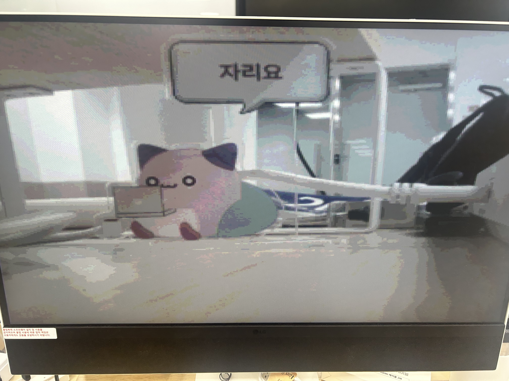
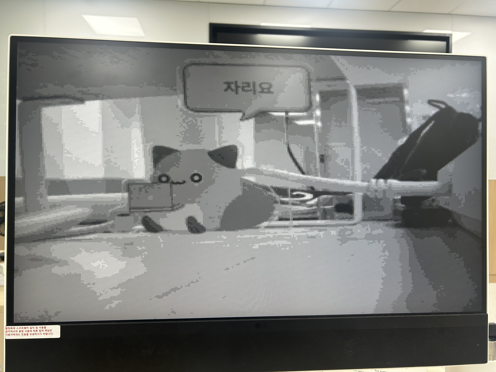
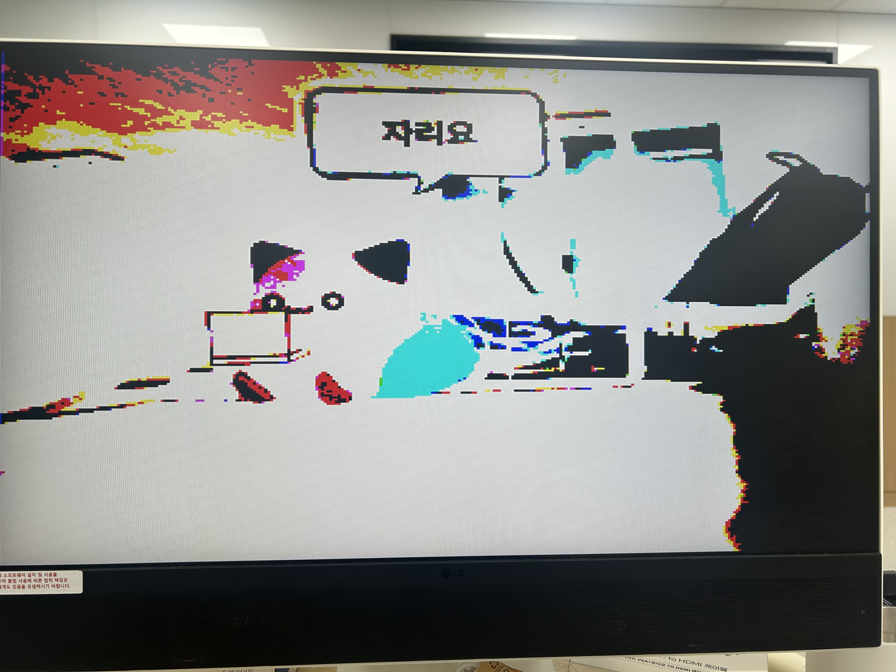
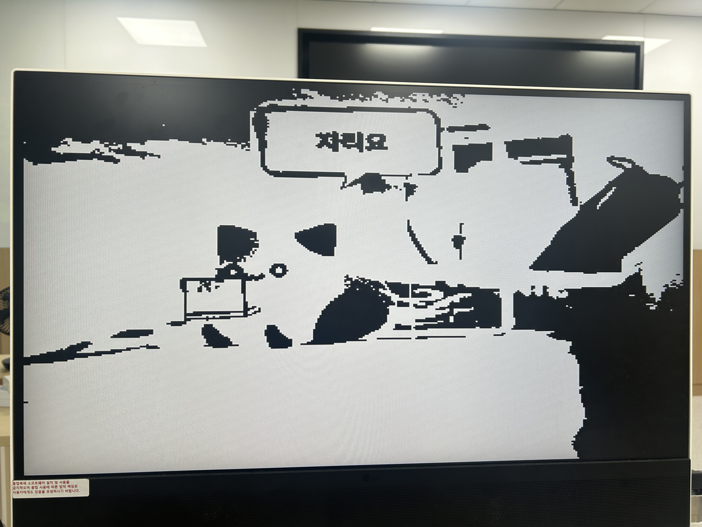

# OV7670 Camera → VGA Display Pipeline

> An FPGA video pipeline that captures live frames from an OV7670 camera through a self-built SCCB/I2C master, buffers them across clock domains, and drives a VGA monitor in real time with runtime-selectable grayscale/binary filters.

---

## Overview

The project has two halves that meet at a dual-port frame buffer: a **camera-side pipeline** (SCCB register configuration → parallel capture → clock-domain crossing) and a **display-side pipeline** (VGA timing generation → frame buffer readout → filters → RGB output). Both the SCCB master and the VGA timing/scan-out logic were written from scratch rather than using vendor IP, so the bring-up process (register-by-register camera configuration, CDC between the camera's `pclk` and the system clock, VGA sync generation) is fully visible in the RTL.

A secondary goal was cross-checking the camera register configuration: an STM32-based reference driver (`stm32/ov7670_setup`) reimplements the OV7670 init sequence with the well-known HAL-based driver, and was used to diagnose gaps in the FPGA's hand-written register ROM when the captured image didn't look right.

---

## Features / Specifications

| Item | Spec |
|---|---|
| Camera | OV7670, SCCB (I2C-compatible) config + 8-bit parallel data |
| Capture resolution | QVGA, 320×240, RGB565 |
| Display | VGA 640×480 @ 60Hz (25MHz pixel clock) |
| Display modes | 1:1 QVGA passthrough, or 2× nearest-neighbor upscale to fill the screen |
| Output color depth | 4-bit per channel (RGB565 capture truncated to RGB444 out) |
| Image filters ㅍ| Grayscale (BT.601-weighted luma), binary threshold (runtime threshold via switches) |
| SCCB master | Custom bit-banged I2C master, 100kHz SCL, command-driven (start/write/read/stop) |
| Camera init sequence | 76-entry register ROM, one-shot FSM with inter-transaction settle delay |
| Frame buffer | Dual-port block RAM, write @ camera `pclk`, read @ system `clk` |
| Target board | Basys3 (Xilinx Artix-7, `xc7a35tcpg236-1`) |
| System clock | 100MHz |

---

## Architecture

```
                     ┌─────────────────────────────────────────────────┐
  Boot-time          │                     sccb.v                      │
  configuration       │  ov7670_setup_rom → i2c_transaction → i2c_master │
                     └──────────────────────┬────────────────────────┘
                                             │ SCL / SDA
                                             ▼
                                        [ OV7670 ]
                                             │ pclk, href, vsync, pdata[7:0]
                                             ▼
  ┌───────────────────────┐   we/waddr/wdata   ┌────────────────────┐
  │ ov7670_mem_controller  │ ─────────────────▶ │    frame_buffer     │
  │  (pclk domain)         │                    │  (dual-port BRAM,   │
  └───────────────────────┘                    │   pclk write /      │
                                                │   clk read)         │
                                                └──────────┬──────────┘
                                                            │ rdata (clk domain)
                                                            ▼
                              vga_control.v          vga_display_data.v
                          (pixel_counter,       ──▶  (frame buffer read,
                           vga_decoder,               1x/2x upscale mux,
                           pclk_gen 25MHz)             RGB565→RGB444)
                                                            │
                                                            ▼
                                              gray_filter → binary_filter
                                                            │
                                                            ▼
                                                   vga_stagereg → VGA pins
```

`top.v` wires these blocks together for the board build; `vga.v` + `image_rom.v` (loading `Lenna_320x240.mem`) is a standalone static-image variant of the display path used to verify VGA timing before the camera was integrated (see `tb/tb_vga.sv`).

---

## Design Details

### 1. SCCB / I2C Camera Configuration

- **`ov7670_setup_rom.v`** holds a 76-entry `{sub_addr[7:0], data[7:0]}` table (`ov7670_setup.mem`), driven sequentially by `sccb.v`'s FSM (`IDLE → OPERATION → WAIT → DELAY → DONE`).
- **`i2c_transaction.v`** sequences one SCCB write per ROM entry (START → slave address → 2 data bytes → STOP). The write data register (`tdr`) is 16-bit and sent **MSB-first** (`sub_addr` then `data`) to match the SCCB byte order — this differs from a generic I2C register interface, which would send the LSB byte first.
- **`i2c_master.v`** is a bit-banged I2C master: a quarter-tick generator divides the 100MHz system clock by 250 to produce a 100kHz SCL, and a `START/WAIT_CMD/DATA/DATA_ACK/STOP` FSM shifts bits out MSB-first and samples the ACK/NACK bit.
- **Bring-up issue — NAK after reset:** the second SCCB transaction (right after the `COM7=0x80` soft-reset write) was NAK'd on real hardware. Root cause: the OV7670 needs a settling time after a soft reset before it will ACK further SCCB traffic — the FSM was issuing the next transaction with no delay. Fixed by adding a counter-based `DELAY` state (1ms @ 100MHz) between every transaction in `sccb.v`.
- **Bring-up issue — washed-out image:** after the NAK was fixed, the captured image displayed but looked hazy/desaturated. Diffing the FPGA's register ROM against the STM32 reference driver's `defaults[]` table surfaced four registers the ROM never touched — `COM8` (AGC/AWB/AEC enable), `AWBCTR0`, `COM4`, `HAECC1` — which were added to `ov7670_setup.mem` (now 76 entries, `ov7670_setup_rom.v` sized accordingly).

### 2. Camera Capture & Clock-Domain Crossing

- **`ov7670_mem_controller.v`** runs entirely in the camera's `pclk` domain: it packs two 8-bit `pdata` bytes (gated by `href`) into one 16-bit RGB565 word per pixel, and resets its write address on `vsync`.
- **`frame_buffer.v`** is a dual-port RAM — write side clocked by `pclk`, read side by the system `clk` — that is the sole crossing point between the camera and VGA clock domains.
- An earlier bring-up bug produced green noise in the captured image, traced to the CDC path occasionally skipping an `xclk`/`pclk` edge; resolved before the filter stages were added.

### 3. VGA Timing & Display

- **`vga_control.v`**: `pclk_gen` divides the 100MHz system clock to a 25MHz pixel clock; `pixel_counter` + `vga_decoder` generate the 800×525 (640×480 visible) VGA timing and `x_pixel`/`y_pixel`/`de`.
- **`vga_display_data.v`**: maps `(x_pixel, y_pixel)` to a frame-buffer address — either the raw QVGA address or a 2× nearest-neighbor upscaled address (`vga_upscaler`) selected by the `mode` switch — and truncates the 16-bit RGB565 sample to 12-bit RGB444. A pipeline stage (`stage_register`) keeps the address, pixel coordinates, and `de` aligned for timing closure.

### 4. Image Filters

- **`gray_filter.v`**: fixed-point BT.601 luma (`77·R + 150·G + 29·B`, scaled), switched in/out per channel.
- **`binary_filter.v`**: per-channel threshold to full-on/full-off, with a 4-bit runtime threshold driven from board switches.

Both filters are pipelined (registered outputs) purely to meet timing, not for functional reasons.

### 5. STM32 Reference Driver

`stm32/ov7670_setup` is a full HAL-based OV7670 driver (`OV7670.c/.h`, `OV7670_REG.h`) running on an STM32F411RE Nucleo board. It isn't part of the FPGA data path — it exists to independently exercise the OV7670's SCCB register set (AGC/AEC/AWB toggles, brightness, saturation, effects, resolution presets) and served as the "known-good" reference when debugging the FPGA's hand-written setup ROM.

---

## Results

<table align="center">
  <tr>
    <td align="center"></td>
    <td align="center"></td>
  </tr>
  <tr>
    <td align="center"><em>(a)</em></td>
    <td align="center"><em>(b)</em></td>
  </tr>
  <tr>
    <td align="center"></td>
    <td align="center"></td>
  </tr>
  <tr>
    <td align="center"><em>(c)</em></td>
    <td align="center"><em>(d)</em></td>
  </tr>
</table>
<p align="center">
  <em>Figure 1. (a) Raw Image from camera. (b) Gray filtered image. (c) Binary filtered raw image. (d) Binary filtered gray image.</em>
</p>

| Metric | Value |
|--------|-------|
| LUT | 322 |
| FF | 273 |
| BRAM | 36 |
| DSP | 1 |
| IO | 37 |
| BUFG | 2 |
| Fmax | 139.99MHz |
| WNS (setup) | 2.857ns |
| WHS (hold) | 0.109ns |

---

## Repository Structure

```
rtl/
├── top.v                      # Board top: camera capture + SCCB init + VGA output + filters
├── vga.v                      # Standalone VGA path driven by static image_rom (pre-camera test)
│
├── sccb.v                     # SCCB top FSM: iterates ov7670_setup_rom, drives i2c_transaction
├── i2c_transaction.v          # SCCB byte-level transaction sequencer (16-bit tdr, MSB-first)
├── i2c_master.v                # Bit-banged I2C master (100kHz SCL) + i2c_master_top wrapper
├── ov7670_setup_rom.v          # 76-entry register ROM (reads ov7670_setup.mem)
├── ov7670_setup.mem             #   {sub_addr, data} pairs for OV7670 init
│
├── ov7670_mem_controller.v    # pclk-domain byte→RGB565 packer (href/vsync framing)
├── frame_buffer.v              # Dual-port BRAM: pclk write / clk read (CDC boundary)
│
├── vga_control.v               # pclk_gen, pixel_counter, vga_decoder (VGA timing)
├── vga_display_data.v          # Frame buffer read, 1x/2x upscale mux, RGB565→RGB444
│   (vga_stagereg in top.v)
│
├── gray_filter.v               # BT.601 grayscale filter
├── binary_filter.v             # Runtime-threshold binary filter
│
├── image_rom.v                 # Static test image ROM (Lenna_320x240.mem)
├── Lenna_320x240.mem / Lenna_640x480.mem
│
tb/
└── tb_vga.sv                   # Testbench for the static-image vga top

docs/
├── i2c_ov7670_setup_timing.txt # Reference SCCB transaction trace used for debugging
└── Lenna*.png                  # Test image renders

stm32/ov7670_setup/             # STM32F411 + HAL reference OV7670 driver
└── Core/{Src,Inc}/OV7670.c, OV7670.h, OV7670_REG.h, main.c
```

---

## Tools

- **Language**: Verilog
- **Target**: Xilinx Artix-7 (Basys3, `xc7a35tcpg236-1`)
- **Environment**: Xilinx Vivado
- **Reference driver**: STM32CubeIDE (STM32F411RE, HAL I2C)
- **Camera module**: OV7670 (SCCB interface)

---

## Design Notes

**Reflection**
- Writing the SCCB master from scratch surfaced a timing requirement that's invisible in a protocol-only view of I2C: the OV7670 needs settling time after a soft reset before it will ACK again. That only showed up on real hardware, not in RTL simulation — a good reminder that datasheet timing constraints have to be modeled explicitly in the FSM, not just the bus protocol.
- The dual-port block-RAM frame buffer turned out to be the simplest way to decouple the free-running camera `pclk` domain from the fixed-rate VGA scan-out domain — no explicit handshake needed once both sides agree on address wrap behavior.
- Keeping the STM32 reference driver around paid off directly: diffing its known-good register table against the FPGA's from-scratch ROM was what pinpointed the missing `COM8`/`AWBCTR0`/`COM4`/`HAECC1` writes behind the washed-out image, instead of guessing at gain/exposure settings.

**Future Improvements**
- Finish matching the STM32 reference's AWB/AEC tuning (ceiling values, matrix/saturation registers) to fully resolve the color/haze difference.
- Turn the fixed one-shot setup ROM into a runtime-writable register interface (e.g. AXI-Lite) so brightness/effects can be changed without re-synthesizing.
- Add a camera bus functional model (BFM) to `tb/` so the capture → frame-buffer → VGA path can be simulated end-to-end instead of only the static-image path.
- Report Vivado utilization and Fmax once the design is timing-closed on hardware.
